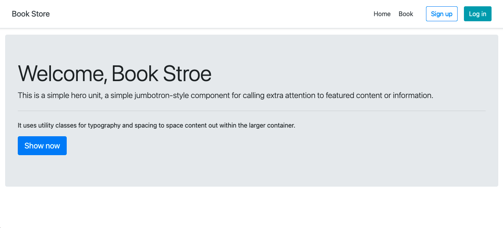

# Python-Django-Bookshop
>Django python framework using to create web bookshop

## Table of Contents
  - [Demo](#demo)
  - [Screenshots](#screenshots)
  - [Technologies](#technologies)
  - [Setup](#setup)
  - [Config project](#config-project)
  - [License](#license)

## Demo
Here is a working live demo: [Basic web Bookshop](https://django-bookshops-basic.herokuapp.com)
## Screenshots
Example web application page
### Home page

### Login page

### Register page

### Book page

### Detail book page

### Add book page


## Technologies
Project is created with:
- [python3](https://www.python.org/)
- [Django](https://www.djangoproject.com/)
- [Bootstrap 4](https://getbootstrap.com/docs/4.6/getting-started/introduction)
- [Heroku](https://www.heroku.com)

## Setup
To clone this project, you need [Git](https://git-scm.com) to install on your computer. command line below:

```zsh
# Clone this repository
$ git clone https://github.com/Bongkot-Kladklaen/Python-Django-Bookshop.git

# Go into the repository
$ cd Python-Django-Bookshop
```
## Config project
<!-- 1. Create database and table :

    Open project `Python-Django-Bookshop` find folder: `database>database.sql` and Import file sql to database server for you
2. Config connect database server : 

    Open project `Python-Django-Bookshop` find file: `app.py` to config: hostname, username, password, database
 
    ```python
        # Config database connect
        hostname = 'localhost
        username = 'root'
        password = 'root'
        database = 'flask_db'
    ``` -->

## License
[MIT](LICENSE)