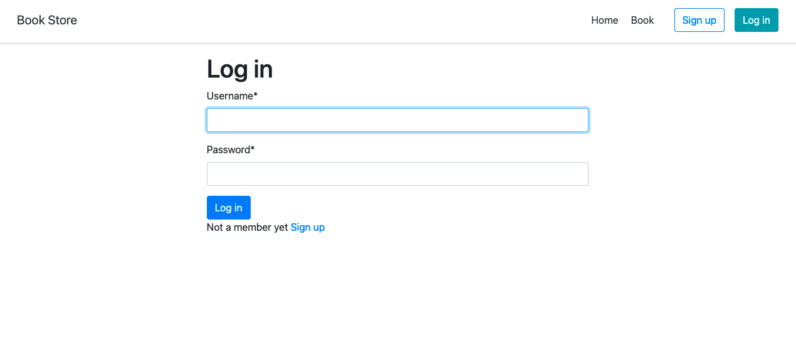
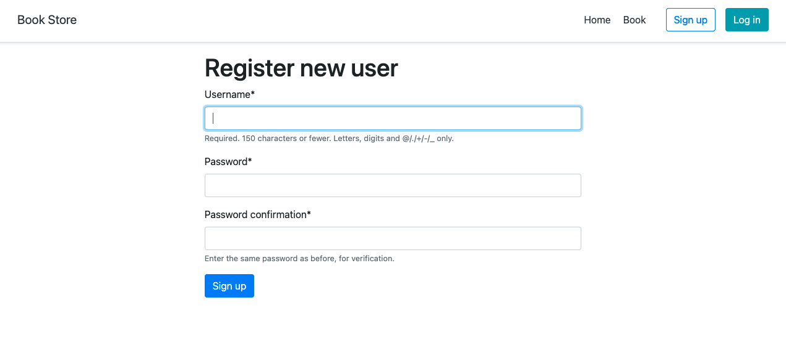
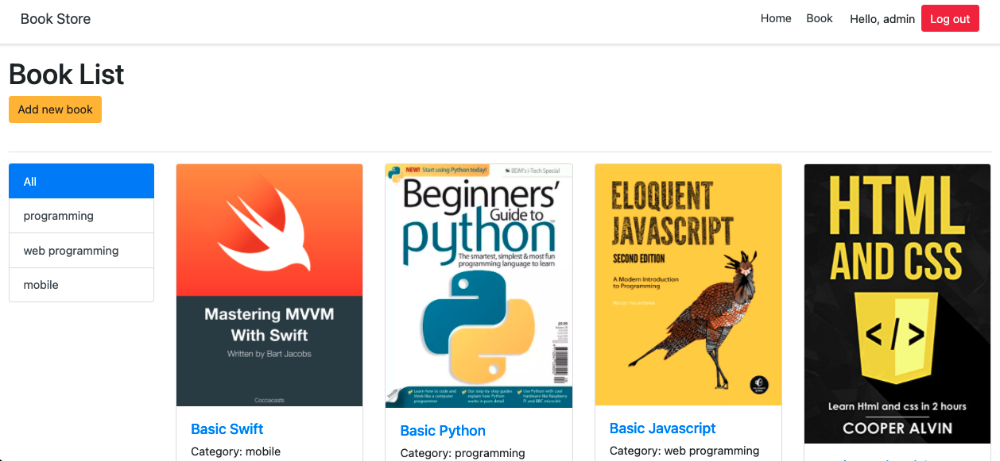
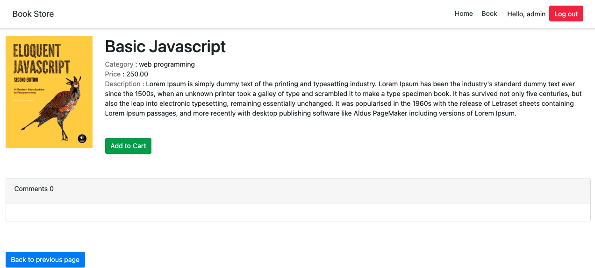
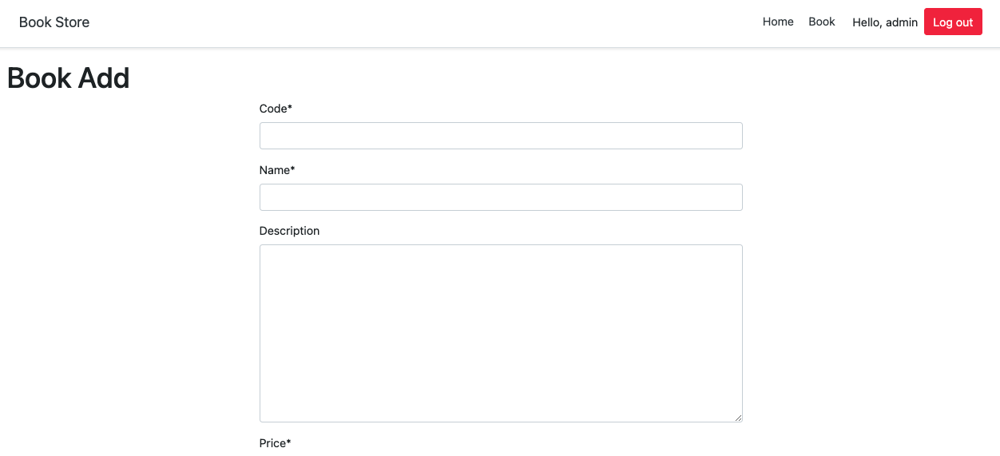

# Python-Django-Bookshop
>Django python framework using to create web bookshop

## Содержания
  - [Скриншоты](#Скриншоты)
  - [Вход](#Вход)
  - [Установка](#Установка)

## Скриншоты
Примеры сайта
### Вход

### Регистрация

### Книга

### Детали книги

### Добавления книги

## Технологии
Проект создан с помощью:
- [python3](https://www.python.org/)
- [Django](https://www.djangoproject.com/)
- [Bootstrap 4](https://getbootstrap.com/docs/4.6/getting-started/introduction)
- [Heroku](https://www.heroku.com)

## Установка
$ git clone https://github.com/ShoxzodAllayarov/Course-work.git

